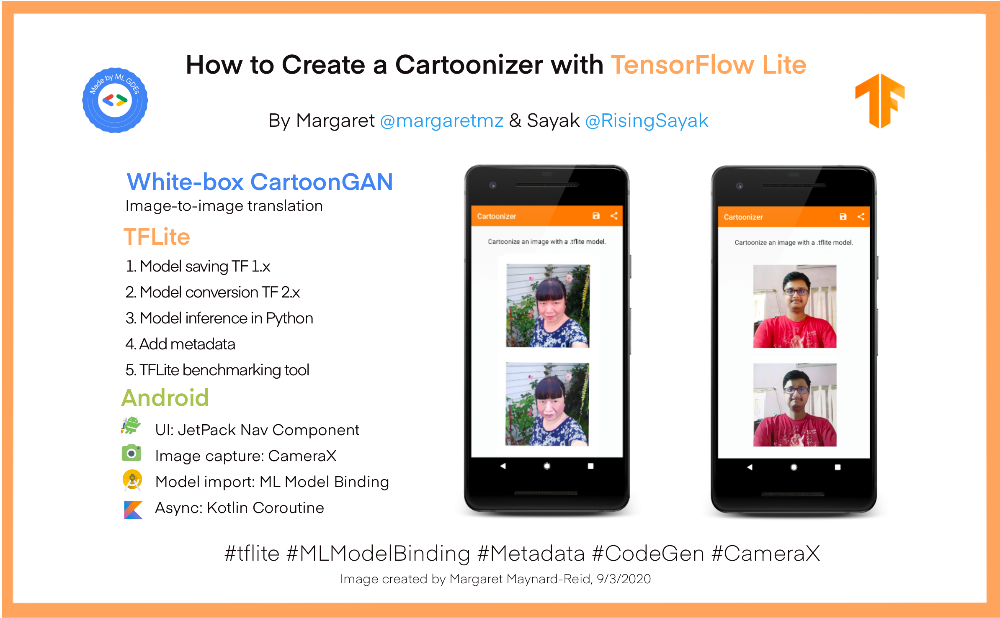

# Cartoonizer with TensorFlow Lite

This is the GitHub repository for an end-to-end tutorial on **[How to Create a Cartoonizer with TensorFlow Lite](https://blog.tensorflow.org/2020/09/how-to-create-cartoonizer-with-tf-lite.html)**, published on the official TensorFlow blog. The tutorial demonstrates the steps for TFLite model saving, conversion and all the way up to model deployment on an Android App. It's one of a series of the [End-to-End TensorFlow Lite Tutorials](https://github.com/ml-gde/e2e-tflite-tutorials). See the full list of TensorFlow Lite samples and learning resources on [awesome-tflite](https://github.com/margaretmz/awesome-tflite). 

<p align="center">

</p>
    
**Authors**: (ML GDEs: Google Developers Experts for Machine Learning)  [Margaret Maynard-Reid](https://twitter.com/margaretmz) and [Sayak Paul](https://twitter.com/RisingSayak)   
**Reviewers**: (Google TensorFlow team) [Khanh LeViet](https://twitter.com/khanhlvg) and [Hoi Lam](https://twitter.com/hoitab) 


## Repo structure
In this project repo, the [ml](ml/) folder contains the model files, and the instructions on how to save the model, and convert it to selfe2anime.tflite, and add metadata to it via either command line or a Colab notebook.  

The [android](android/) folder contains the Android source code and the instructions on how to build the Android app.

## The White-box CartoonGAN model
We used a Generative Adversarial Network (GAN) model proposed in this CVPR 2020 paper [Learning to Cartoonize Using White-box Cartoon Representations](https://github.com/SystemErrorWang/White-box-Cartoonization/blob/master/paper/06791.pdf). The pretrained weights were provided by the authors of the paper and available in their project GitHub repository [here](https://github.com/SystemErrorWang/White-box-Cartoonization).

## Citation
The original authors of White-box CartoonGAN are Xinrui Wang and Jinze Yu.
```
@InProceedings{Wang_2020_CVPR,   
author = {Wang, Xinrui and Yu, Jinze,     
title = {Learning to Cartoonize Using White-Box Cartoon Representations,   
booktitle = {IEEE/CVF Conference on Computer Vision and Pattern Recognition (CVPR)},   
month = {June}, year = {2020} }
```

## Acknowledgement
We would like to thank Khanh LeViet and Lu Wang (TensorFlow Lite team), Hoi Lam (Android ML), and Soonson Kwon (ML GDEs Google Developers Expert Program), for their collaboration and continuous support.

<div align="center"></div>